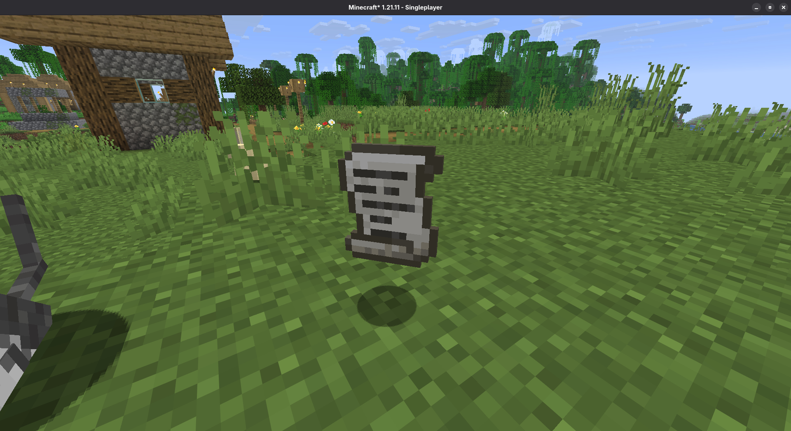
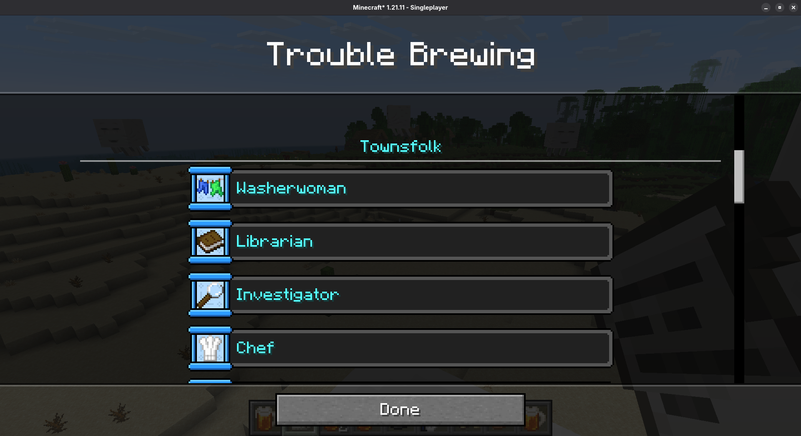
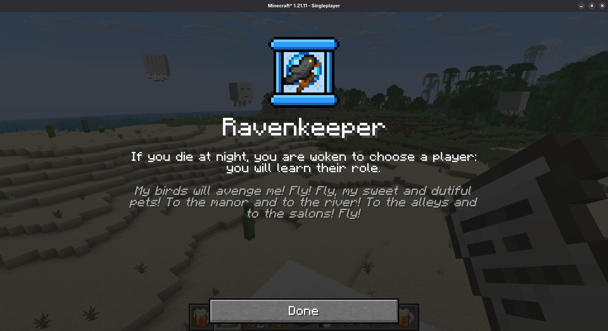
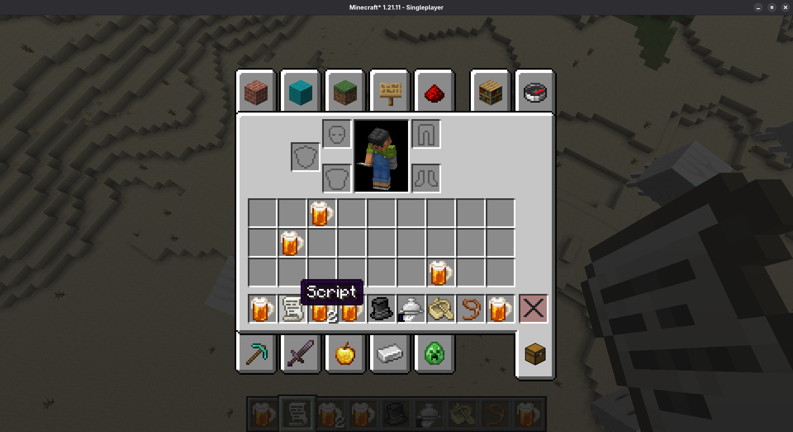

# Blood on the Blocktower

Inspired by the Blood on the Clocktower episodes of Yogscast, this mod is a Minecraft adaptation of Blood on the Clocktower, providing the utilities to play BOTC in Minecraft.

## Development Progress
- [x] Items for role icons
- [x] Loading roles and scripts from datapacks
- [x] Generating and loading Trouble Brewing script
- [x] Script and role overview
- [ ] Map maker tools (in progress)
- [ ] Grimoire item
- [ ] Grimoire GUI
- [ ] Trouble Brewing is playable
- [ ] Implementations of items for other scripts

## Screenshots

## Dependencies
To run this mod, you must use:
- Minecraft, version _1.21.11_ (Mounts of Mayhem drop)
- Fabric Loader, version _0.18.2_ or higher
- Fabric API, version _0.139.4_ or higher
- Fabric Kotlin Support, version _1.13.7_ or higher

## Disclaimer

Blood on the Clocktower is copyright of The Pandemonium Institute. This mod is an independent adaptation that allows playing Blood on the Clocktower in Minecraft and is not affiliated with the original game or its creators.

## License

**Licensed under the GPL v3 open source license.**

Copyright (C) 2025 Runefox

This program is free software: you can redistribute it and/or modify
it under the terms of the GNU General Public License as published by
the Free Software Foundation, either version 3 of the License, or
(at your option) any later version.

This program is distributed in the hope that it will be useful,
but WITHOUT ANY WARRANTY; without even the implied warranty of
MERCHANTABILITY or FITNESS FOR A PARTICULAR PURPOSE.  See the
GNU General Public License for more details.

You should have received a copy of the GNU General Public License
along with this program.  If not, see <https://www.gnu.org/licenses/>.
